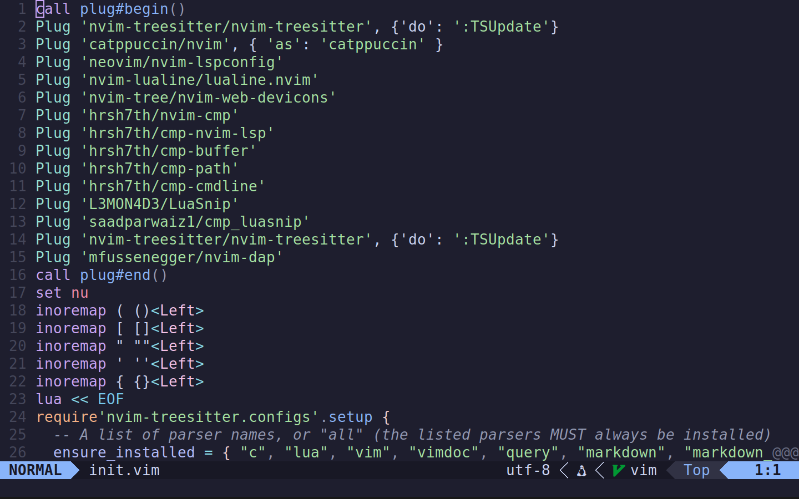

a semi-minimal neovim config



# Installation
first of all install [vim-plug](https://github.com/junegunn/vim-plug)
```

git clone https://github.com/olight0/nvim-config
cd nvim-config
mkdir ~/.config/nvim
mv init.vim ~/.config/nvim/
nvim +PlugInstall

```
